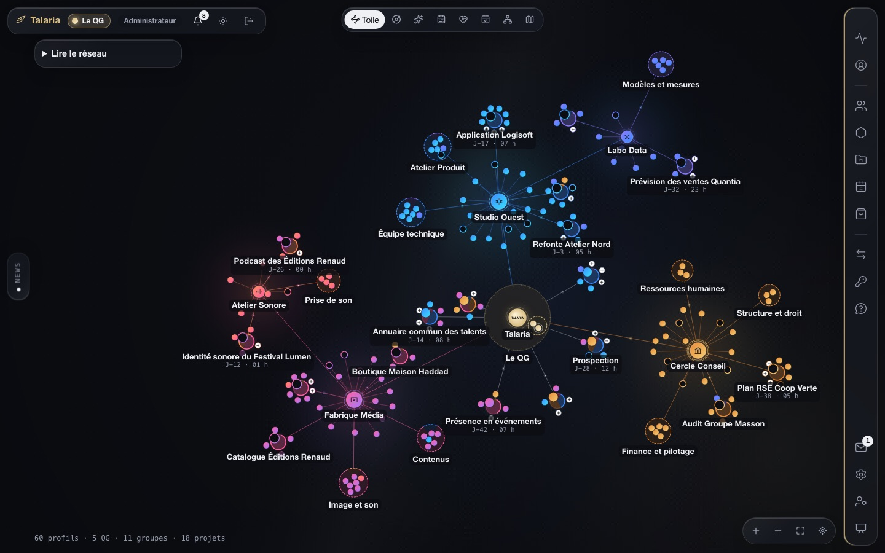
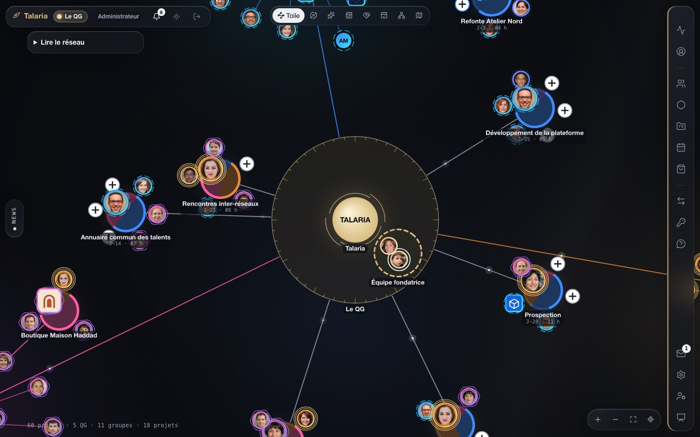
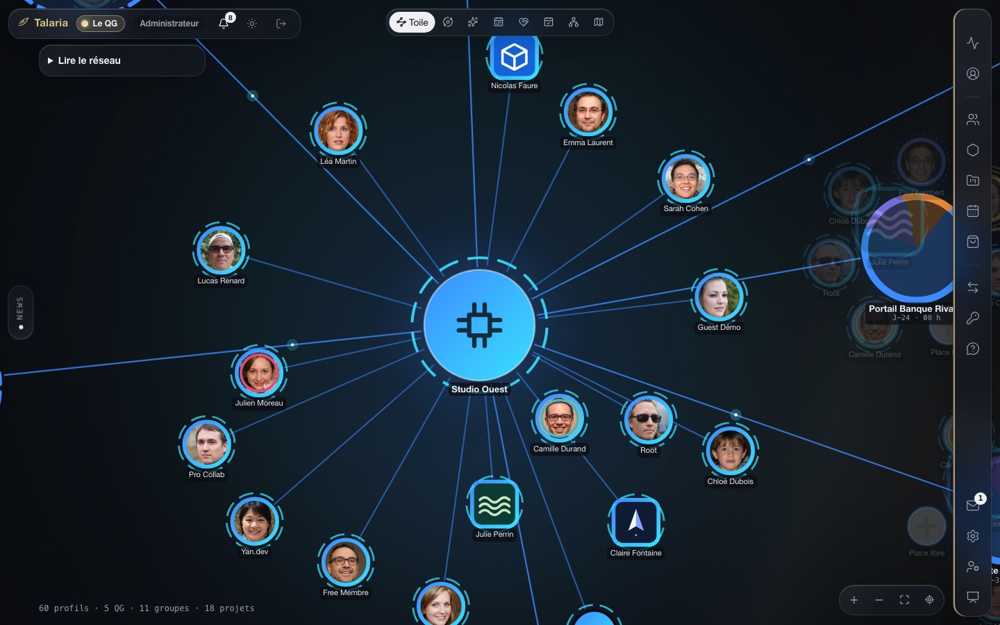
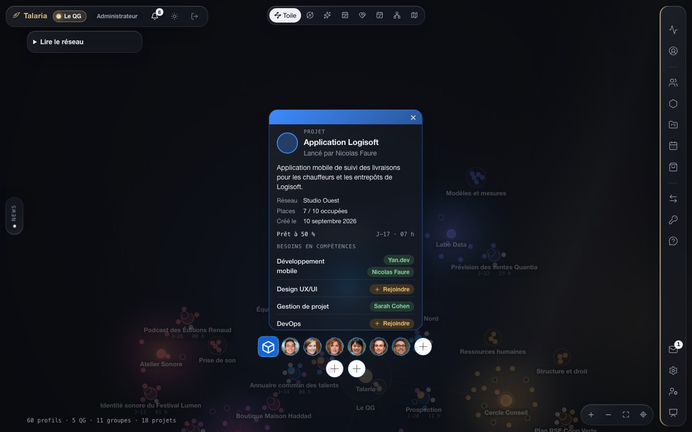
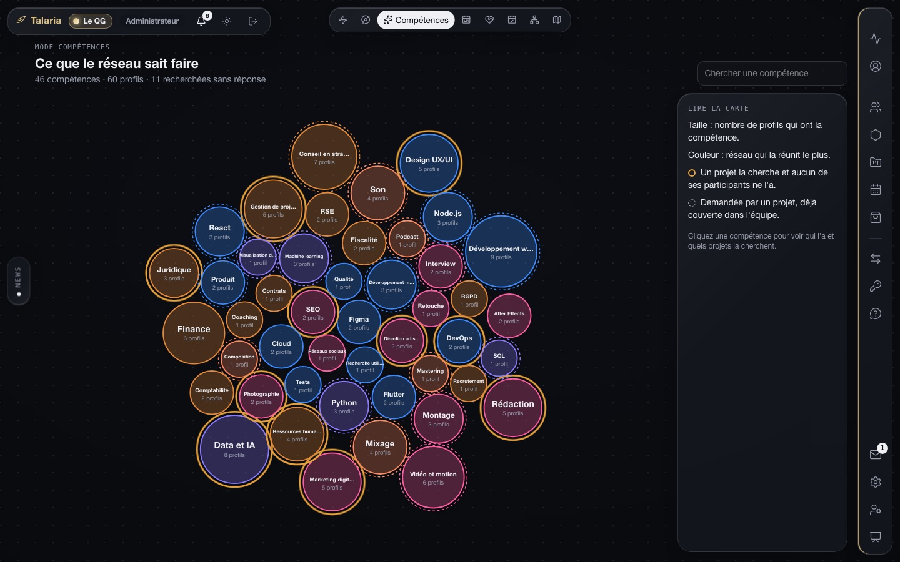
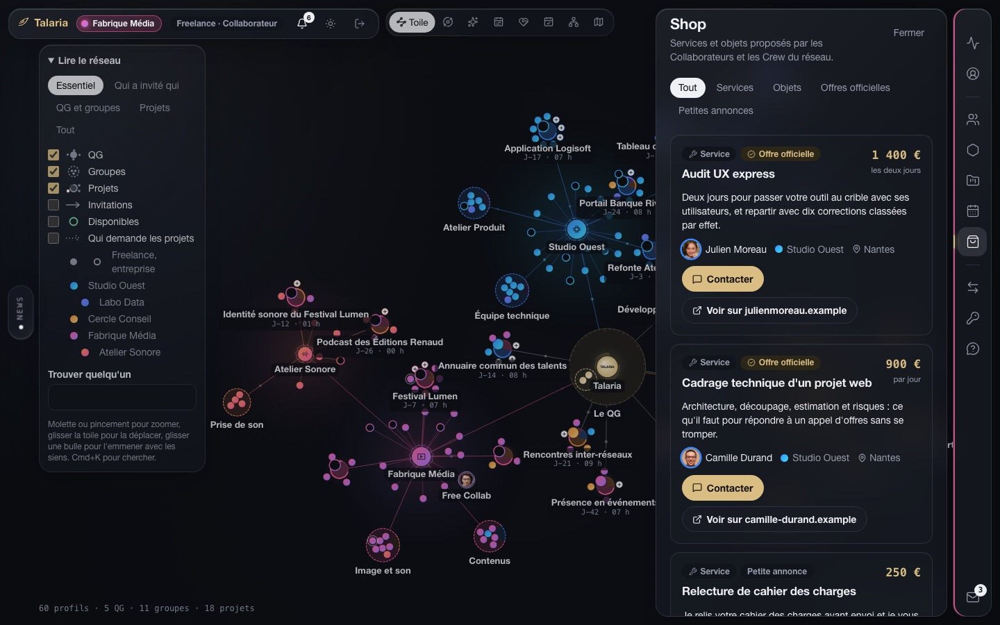
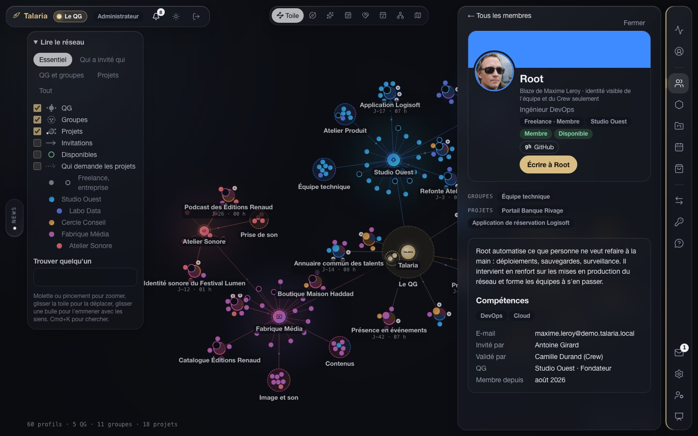
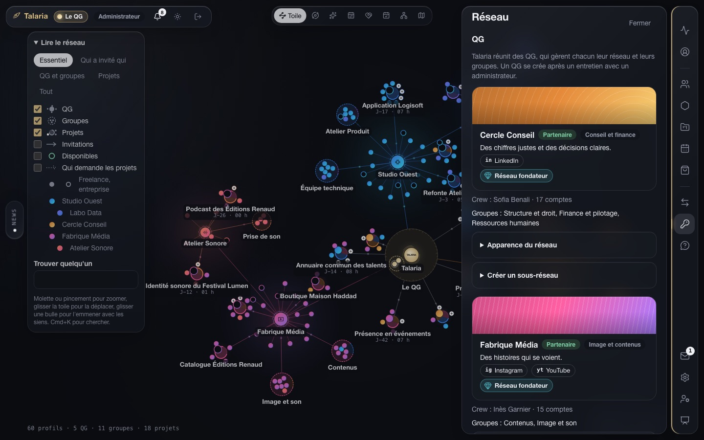
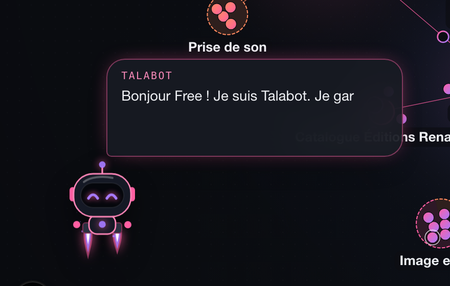

<h1 align="center">Talaria</h1>

<strong>Le réseau privé où les meilleurs indépendants et les entreprises qui les cherchent se retrouvent sur une seule carte.</strong>

Sur cooptation · Prototype en développement

> Ce dépôt est la **vitrine** du projet. Il présente Talaria et son avancement. Le code du produit vit dans un dépôt privé et n'est pas publié ici.

## Le principe

On entre dans Talaria parce que quelqu'un se porte garant. On y retrouve son réseau sur une toile vivante, et on y forme les équipes qu'on n'aurait jamais montées seul.

| | |
|---|---|
| **Cooptation** | Un membre propose une invitation et la défend. Le responsable du réseau l'accepte. Chaque profil garde qui l'a invité et qui l'a validé. |
| **Réseaux** | Talaria réunit des réseaux, chacun avec son responsable, son secteur et son identité. Un réseau qui grandit crée un sous-réseau. |
| **Une carte vivante** | Chacun voit le réseau selon son rôle : les noms se dévoilent à mesure que l'on s'engage. |

## Ce que l'on y fait

### Voir son réseau

Tout Talaria tient sur une toile : au centre, le QG ; autour, les réseaux, leurs groupes et leurs projets. Des lumières la parcourent, des impulsions suivent les liens.

### Reconnaître les siens

Chaque réseau tient son identité de son secteur d'activité : deux couleurs, un motif, un emblème. Tous ses membres la portent. Une personne a un portrait rond, une entreprise son logo.

### Monter un projet

Le contour d'un projet se remplit à mesure que ses compétences sont couvertes ; un compte à rebours indique son départ. Une place libre ? On rejoint en un clic.

### Répondre à une question

Huit façons de regarder le même réseau : qui sait faire quoi, quand, avec qui, qui est libre, qui a invité qui, et où.

### Proposer ses services

À partir d'un certain niveau d'engagement, on propose un service ou un objet au Shop : une petite annonce entre membres, ou une offre officielle reliée à son site.

### Se présenter comme on l'entend

Un blaze peut remplacer le nom. L'identité réelle reste connue de ceux qui garantissent la cooptation.

### Faire vivre un réseau

Le responsable d'un réseau choisit son secteur, accepte les invitations, ouvre des accès de passage et suit son activité.

## Talabot

L'assistant de Talaria est un petit robot à jetpack. Il prend les couleurs du réseau de la personne, lui rend visite sur la toile, lui dit ce qui la relie au profil qu'elle consulte, et mène la visite guidée.

 

## Les rôles

| Rôle | Ce qu'il voit et fait |
|---|---|
| **Guest** | Le réseau qui l'accueille, encore anonyme. Il termine son inscription pour devenir Membre. |
| **Membre** | Son réseau. Il rejoint des projets et des groupes, propose des invitations. |
| **Collaborateur** | Tous les réseaux. Il forme des groupes et vend au Shop. |
| **Crew** | Il gère un réseau : invitations, identité, sous-réseaux, accès de passage. |
| **Équipe Talaria** | Elle crée les réseaux après un entretien et règle le fonctionnement de l'ensemble. |

## Où en est le projet

Talaria est un **prototype** : il montre l'intention du produit et sert de base de travail. Il n'est pas encore ouvert.

| Fait | En cours |
|---|---|
| Cooptation, rôles et niveaux | Envoi des invitations par e-mail |
| Toile du réseau et huit modes de vue | Assistant branché à un modèle |
| Réseaux, sous-réseaux, groupes, projets | Paiement et commissions |
| Messagerie, calendrier, questionnaires, badges | Mise en production |
| Shop, profils, blazes | Application téléphone complète |

Les personnes, les entreprises et les logos visibles sur les captures sont inventés pour la démonstration.

## Accès

Talaria est un réseau privé : on y entre sur invitation d'un membre. Il n'y a pas d'inscription ouverte.

---

© Talaria. Tous droits réservés. Les textes et les images de ce dépôt ne sont pas libres de droits.

